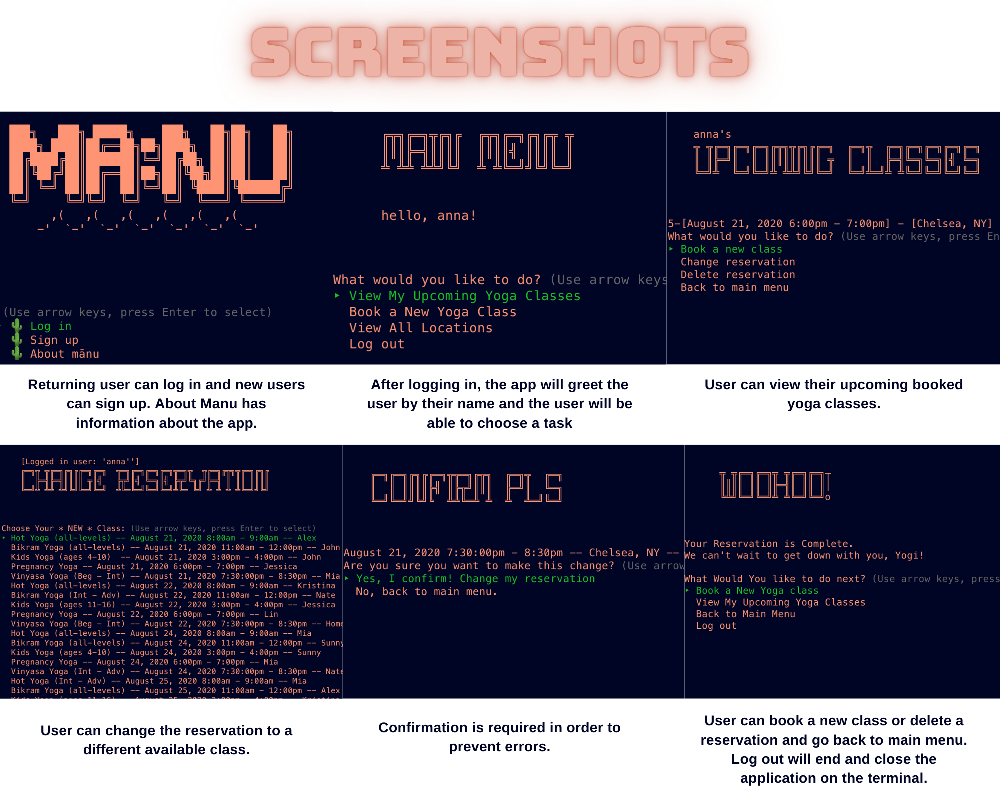

# Mānu
Mānu is a Ruby CLI application for booking yoga classes in one of the many yoga studios around New York City. 

## Features
* Sign up/log in using a username and password [includs validations on username and pw]
* Book a yoga session at a chosen location (Create)
* View all upcoming classes (Read)
* Change reservations (Update)
* Delete reservations (Delete) [Confirmation included]

## Set Up
1. Clone this repo to your local computer [-git clone <git repository>]
2. CD into the MANU-Yoga-Booking-CLI-App repo
3. Run 'bundle install' to install all required dependencies
4. Run 'rake db:migrate' to create tables into the databse
5. Run 'rake db:seed' to create seed data
6. Run 'rake start' to run the app!

## Tech Stack
* Ruby [2.6.1]
* SQLite3 [~> 1.4] - Database
* TTY::Prompt - Gem that provides easy option selection
* Rake - Task manager

## Screenshots
 </img>

## Status
This project is completed.

## Inspiration Behind Mānu
This project was inspired by my cohort, Hortencia Cisneros and my love of yoga and mindful movements that brings happiness to people. Despite the extraordinary times that we are living in currently because of Covid-19, New Yorkers have continued to pursue wellness of their mind and body and we hope that will never change.

## Created by
* [Anna Kim](https://www.linkedin.com/in/problemsolveranna/) - Let's Connect! 👋🏻

